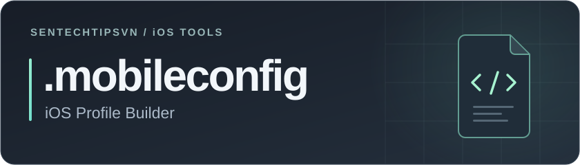

  

  

  <a href="https://developer.apple.com/ios/"><code>iOS</code></a>
  &nbsp;
  <a href="https://developer.apple.com/documentation/"><code>XML plist</code></a>
  &nbsp;
  <a href="https://www.icloud.com/shortcuts/aedce64c80ea4a639e20958c073cfebd"><code>Shortcuts</code></a>

  
<strong>Tạo hồ sơ cấu hình iOS theo cách của bạn.</strong>

  

    <a href="Language/vi.md"><strong>Tiếng Việt</strong></a>
    &nbsp; · &nbsp;
    <a href="Language/en.md"><strong>English</strong></a>
  

## Tổng quan

Công cụ tạo tệp **`.mobileconfig`** ngay trên iPhone. Nhập thông số, tạo XML và chuyển sang **Phím tắt** để đặt tên, lưu tệp vào thư mục bạn chọn.

## Cấu hình hỗ trợ

`WebClip` · `Wi-Fi` · `DNS` · `VPN` · `Mail` · `Chứng chỉ` · `Chính sách mật mã`

## Điểm chính

| Tính năng | Mô tả |
| :--- | :--- |
| **Xử lý trên thiết bị** | Tạo XML, xử lý icon và chứng chỉ ngay trong trình duyệt. |
| **Xuất qua Phím tắt** | Nhận văn bản XML, đặt tên `.mobileconfig` và tự chọn nơi lưu. |
| **Triển khai gọn nhẹ** | Website tĩnh dùng HTML, CSS và JavaScript; chạy trên GitHub Pages. |

Hướng dẫn sử dụng, xây dựng Phím tắt và thông số kỹ thuật có trong [tài liệu tiếng Việt](Language/vi.md) và [English documentation](Language/en.md).

---

  Thiết kế và phát triển bởi <strong>Sentechtipsvn</strong>

